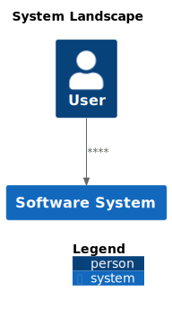
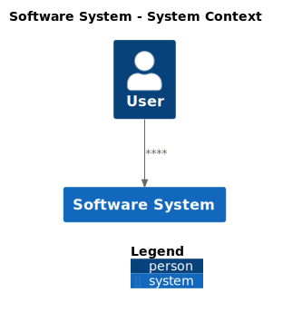
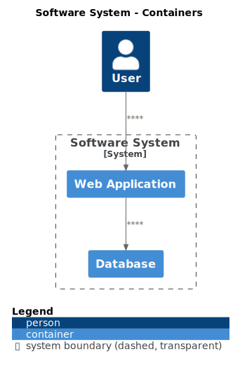
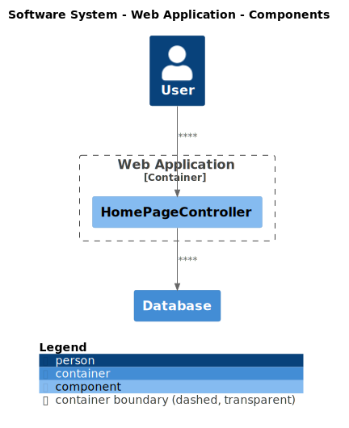
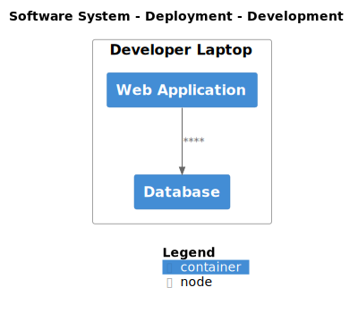
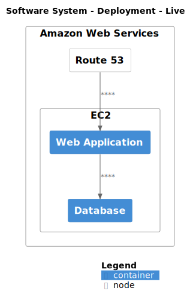
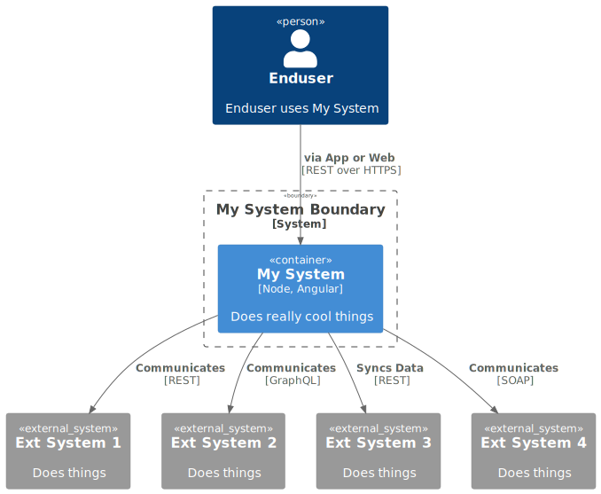
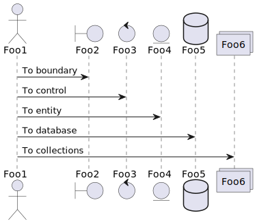

This part of the project documentation focuses on an
**understanding-oriented** approach. You'll get a
chance to read about the background of the project,
as well as reasoning about how it was implemented.

> **Note:** Expand this section by considering the
> following points:

- Give context and background on your library
- Explain why you created it
- Provide multiple examples and approaches of how
    to work with it
- Help the reader make connections
- Avoid writing instructions or technical descriptions
    here

## C4 Diagramm
### System Landscape

### System Context 

### Containers 

### Components 

### Deployment Development 

### Deployment Live 

##Component

## Sequence

